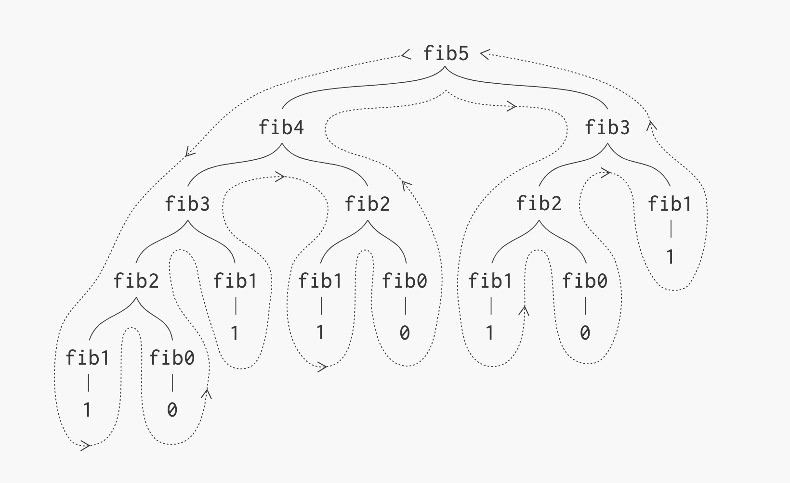

# Recursive Fibonacci

La sucesión de Fibonacci es una serie de números en la que cada término se obtiene sumando los dos anteriores.

Implementar una función que, dado un número entero n, retorne el n-ésimo término de la sucesión de Fibonacci.

La sucesión comienza con F(0) = 0 y F(1) = 1, y cada término siguiente se obtiene sumando los dos anteriores:

```bash
F(n)=F(n−1)+F(n−2)para n≥2
```

Por ejemplo:

- fib(4) => 3
- fib(7) => 13

## Fibonacci Tree


